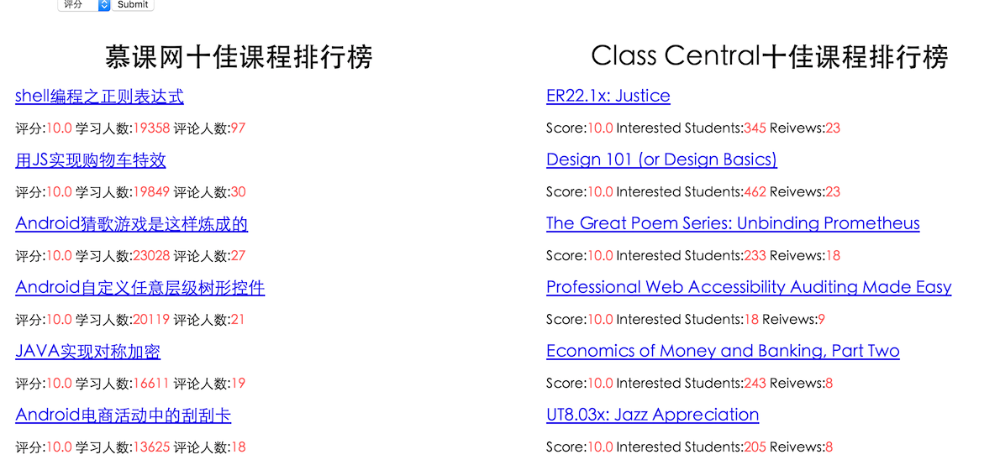

# CourseWebCrawler
CourseWebCrawler is a web crawler for courses on scrapy. We create the crawler to collect the courses from imooc and class-central. The we generate a rank list to recommend for users.

**Demo:** http://123.56.12.211:8000/rank/

## Motivation

There are thousands of courses on the websites. We aim to provide valuable and popular courses for user who want to learn something. In addition, we want to find out the technical hot points in recent years.

## Components

 This project consists of three components:

1. 2 crawlers to dig the courses' infomation from imooc and class-central.
2. A background server created by django to get info from mongodb.
3. A front-end webpage to display rank of the courses.

## Crawler

[http://www.imooc.com](http://www.imooc.com) and [http://www.class-central.com](http://www.class-central.com) are the two websites we crawl. We crawled the name, score, student number, review number and keywords for each course. We created a keyword lists to mark each course for later use. All collected infomation are stored in mongodb.

## Display

We use django to create the background server. Pymongo library is used to connect mongodb. we provide the rank and search functions. The rank page list the top 10 popular courses from imooc and class-central, sorted by score, student number and review number.

## Team Members

[https://github.com/orgs/BitTigerInst/teams/coursewebcrawler](https://github.com/orgs/BitTigerInst/teams/coursewebcrawler)

## Resource

- [CourseWebCrawler](https://github.com/BitTigerInst/CourseWebCrawler)
- [Scrapy](http://scrapy.org/)
- [MongoDB](https://www.mongodb.com/)
- [Django](https://www.djangoproject.com/)

## License

See the [LICENSE](LICENSE) file for license rights and limitations (MIT).

## Project Infomation

- category: full stack
- team: CourseWebCrawler
- description: a Scrapy project to crawl valuable online courses.
- stack: scrapy, mongodb, django

